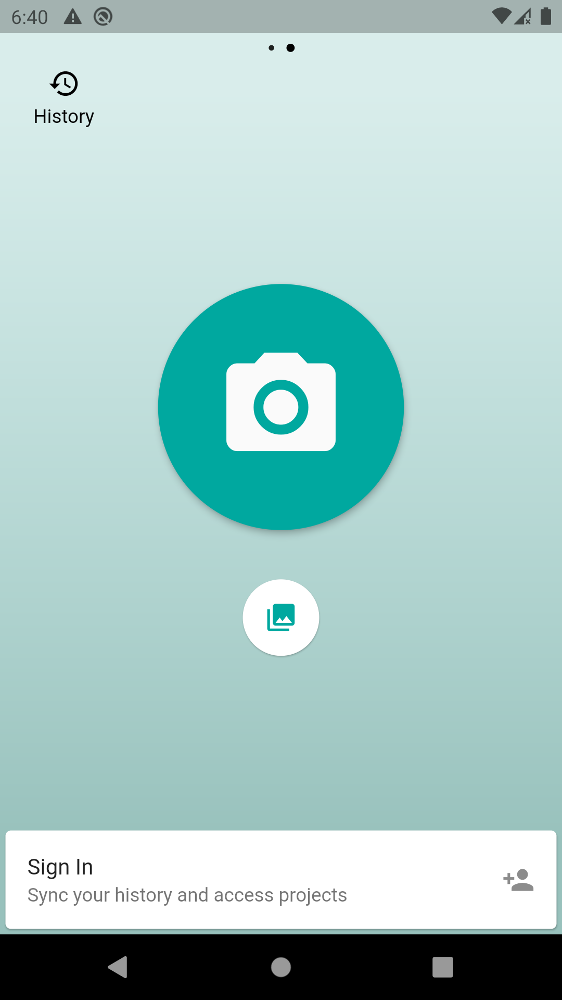
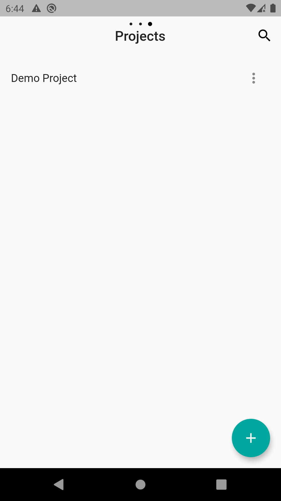
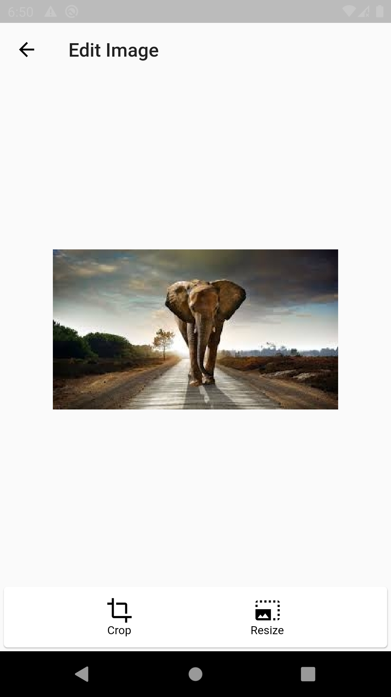

# LabelLab Mobile App

Mobile client for LabelLab (Machine learning supported image labelling tool for researcher)

## Setting up the project

After cloning the directory and changing the directory to the project in terminal, run:

1. `cd labellab-server`

After running `npm install` 

2. Run the Node server in the labellab-server folder:
    
`$ npm start`

> **NOTE**: Before starting the server create a file named `.env` same as `.env.example` and add your **OAUTH** and **DATABASE** credentials in the file.

In a new terminal navigate to `labellab_mobile` directory.

Configure the `lib/config.dart` using the format provided in `lib/config_example.dart`.

Application needs `google-services.json` issued from firebase to run google sign in option. To obtain the file,

1. Sign in to [Firebase Console](https://console.firebase.google.com)
2. Click **Add Project** and necessary information about the project.
3. Agree to the terms and click **Create Project**.
4. After creating the project, click **Add Firebase to your android app**.
5. Go to project location and open `android/app/src/main/AndroidManifest.xml`.Copy the package name(**org.scorelab.labellab_mobile**) and paste in the package name field
6. Get the **SHA1 fingerprint** by following the instruction and paste it in the SHA1 fingerprint field.
7. click next and download the `google-services.json`.
8. paste the file in location `android/app/` folder.
For building the application run:

Application needs a **Google maps API** key for the Google maps integration. To obtain a key,

1. Visit [Google Maps Platform](https://cloud.google.com/maps-platform)
2. Sign in with the same Google account used to create the firebase project
3. Open `android/app/src/main/AndroidManifest.xml` file
4. Replace `API_KEY_HERE` with the new key 

If you haven't enabled Google Map SDK, 

1. Visit [Google Developers Console](https://console.cloud.google.com)
2. Choose the same firebase project
3. On the navigation menu, select **Google Maps** and select **APIs** under the Google Maps menu
4. To enable Google Maps for Android, select `Maps SDK for Android`, then **ENABLE**
5. To enable Google Maps for iOS, select `Maps SDK for iOS`, then **ENABLE**

Go back to the terminal, and to build the app

`flutter build apk`

> **NOTE**: Use 'ios' instead of 'apk' to build for iOS

or run the flutter application

`flutter run`

> **NOTE**: A device with USB debugging enabled or virtual device is required

## Using LabelLab app

 

Initially the app presents you with the above screens. There you can upload images and get classifications without signing in. 

## Sign In

 

1. Sign in via google/GitHub or via filling out the information

2. You will be on the dashboard and will be able to view all of your old projects or even build a new one.

## Starting a New Project

  

1. You can create a new project by clicking start a new project button in the dashboard where you will have to fill out the name of the project and then the app will prepare some files making the project for you.

2. After setting up the project you can add the project members and their respective roles by adding their emails.

## Uploading Images

  

1. By selecting Project Images or clicking an image you will be able to add images. 

2. You are able to choose the images from your app too and submit the images on the app.

## Edit images

  

1. When uploading an image you can crop, rotate and resize it

2. Click on the edit icon on the top of the image preview to goto editing screen

## Creating a New Label

 

1. You can add labels by clicking the add icon in the labels menu

2. Also you can add labels in the labeling screen too

## Label an image

   

1. You can select an image and click on the label action to label them

2. In the labeling screen you can select a label and draw its path 

## Object path

 

1. You can view object path by clicking the view path option 

## Classification 

 

1. In the home screen you can upload an image and get classification without creating a project

2. Click on the camera or gallery icon to take an image or select one from gallery 

## Demo Video

Watch this [Demo Video](https://www.youtube.com/watch?v=9UG7UEyQans) of the finalised mobile app to see how to use it
